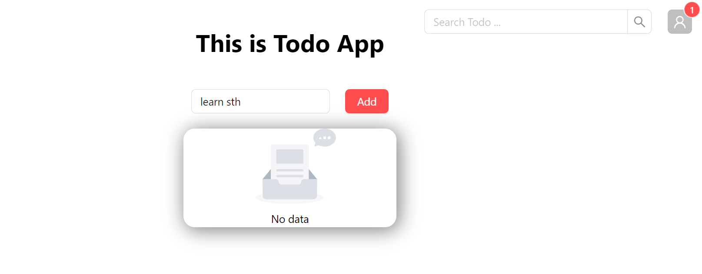
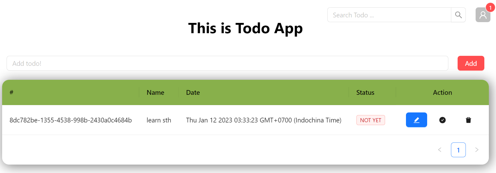
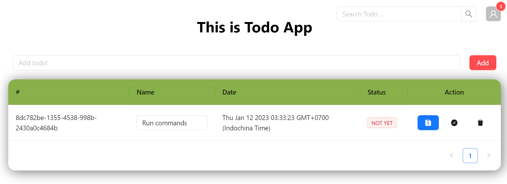
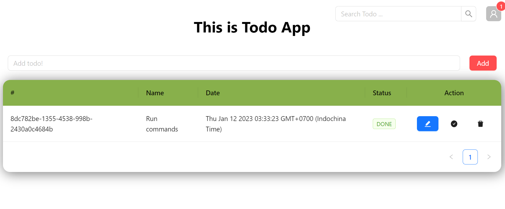
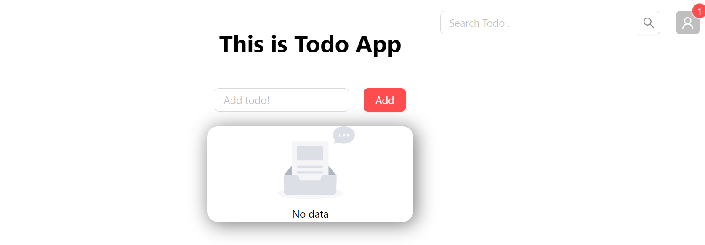

# This is my Todo application
I deployed it in the 
## Available Scripts

In the project directory, you can run:

### `npm install`
You must run this command first to install the dependencies when you clone this repository.

### `npm start`

Runs the app in the development mode.\
Open [http://localhost:3000](http://localhost:3000) to view it in your browser.

The page will reload when you make changes.\
You may also see any lint errors in the console.

### `npm test`

Launches the test runner in the interactive watch mode.\
See the section about [running tests](https://facebook.github.io/create-react-app/docs/running-tests) for more information.

### `npm run build`

Builds the app for production to the `build` folder.\
It correctly bundles React in production mode and optimizes the build for the best performance.

The build is minified and the filenames include the hashes.\
Your app is ready to be deployed!

See the section about [deployment](https://facebook.github.io/create-react-app/docs/deployment) for more information.

## Some pictures of this project

1. First site 

2. Add todo 

3. Edit todo 

4. Mark as done 

5. Delete todo 
